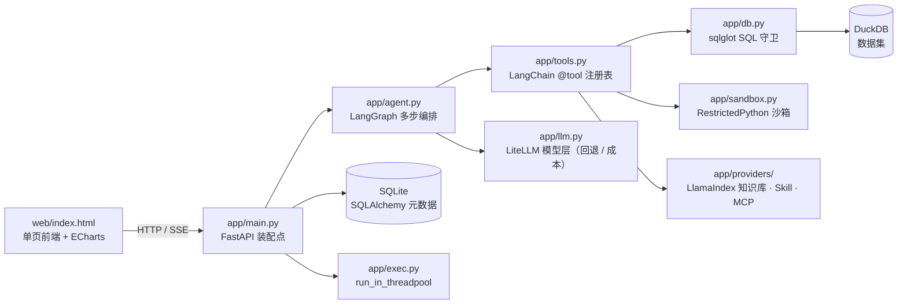

<div align="center">

# 📊 知析 · AI 数据分析助手

**上传一张业务表格，用中文提问 —— 模型自己规划步骤、调用工具查数与算数，给出带数字依据的结论**

[](https://github.com/Lsilence7807/Knowledge-Analysis-Assistant/actions/workflows/ci.yml)


单机部署 · 零外部服务 · 结论里的每个数字都能回溯到结果表的某一行

</div>

---

## 📸 效果预览

| 提问 → 步骤 → 结论 | 图表与结果表 |
| :---: | :---: |
|  |  |

上图问答用的就是仓库自带的 `examples/demo_sales.csv`（240 行 × 7 列），可直接上传复现。

## 🎯 它解决什么问题

业务方要一个数，通常要等数据同学写 SQL、发文件、再回来确认口径。这个项目把这条链路压成一句话：**上传表格 → 用中文提问 → 拿结论**。

可不可信不靠模型自觉，靠工程约束：

- 模型只负责「规划 + 选工具」，取数与算数交给 SQL 引擎和统计函数；结论里的数字必须能指认到结果表的某一行某一列（`row` + 列名）；
- SQL 只放行单条只读 SELECT，越权、超时、超行数一律拒绝；
- 证据不足写进「注意事项」，不编造；指代不清先反问。

## ✨ 核心能力

**数据接入与画像**

- CSV / XLSX / XLS（≤50MB）上传 → 自动清洗（列名归一、类型推断、完全重复行去重、缺失率统计、空列提示）→ 落 DuckDB 数据集
- 数据画像：行列数、字段类型、缺失率、枚举样例；清洗日志逐条可查
- 数据集带版本号，重导入或改清洗规则自动 +1

**多步 Agent 分析**

- 中文提问 → 模型自主规划并依次调用工具（默认 ≤6 步）；每步的工具名、耗时、返回行数、参数摘要都在「步骤」面板可查
- 内置工具：SQL 查询、描述统计、IQR + z-score 双规则异常检测、指标口径、知识库检索、Skill、MCP、受限代码执行
- 步数用尽返回已完成的部分，而不是报错

**结论输出**

- 结构化结论卡片：摘要 / 发现 / 异常 / 建议 / 置信度 / 注意事项
- 每条发现标明依据的行与列；表里答不了的部分直接说答不了，不硬凑

**可插拔扩展**（各自独立开关，关闭或故障时降级而非报错）

- **Skill**：`SKILL.md` 目录技能包，prompt 型注入上下文，script 型在受限子进程执行
- **知识库**：md / txt / pdf / docx → 分块（≤500 字符）→ SQLite FTS5 检索 → 带出处的片段注入
- **MCP**：按配置接标准 stdio server，白名单调用，返回内容按不可信数据处理

**交互**

- 单页前端：上传 → 选数据集 → 提问 → SQL（可折叠）→ 步骤 → 结论卡片 → 结果表 → 图表
- SSE 流式：`plan → sql → row_count → token* → insight → trace → done`，客户端断开即取消上游模型调用
- ECharts 走本地资源离线可用，柱状 / 折线 / 饼图可切换

**模型接入**

- 页面填任意 OpenAI 兼容厂商的 `base_url` + 模型名 + 密钥，写本机 `config/local.json`，免重启生效
- 密钥不进代码、日志与 SQL

## 🔒 安全边界

| 面 | 做法 |
| --- | --- |
| SQL | 只允许单条 SELECT；拒不许多语句、DDL/DML；只读连接；10s 超时；5000 行封顶，超限只回摘要与列名 |
| 代码执行 | AST 静态检查 + `python -I` 隔离子进程 + import 白名单 + 20s / 1MB 限额 + 只注入当前数据集的只读副本（进程级隔离，非容器级） |
| 提示注入 | 知识库、MCP、上传内容一律按不可信数据包裹，并剥离指令性内容 |
| 密钥 | 只从本机 `config/local.json` 或环境变量读取，不进仓库、日志与 SQL |

## 🏗️ 架构



## 🚀 怎么跑

什么都不想敲：**双击 `启动.cmd`**。首次会自动建 `.venv`、按 `requirements.lock` 装依赖、起服务并打开 `http://127.0.0.1:8017/`；之后每次双击直接起来（服务已在跑就只开页面）。需要机器上有 Python 3.11+。

想手动来，就按下面四条命令：

```
& .\.venv\Scripts\python.exe -m pip install -r requirements.txt
# 复现当前环境锁版本：pip install -r requirements.lock（requirements.txt 留给想装最新版本的人）
& .\.venv\Scripts\python.exe -m uvicorn app.main:app --port 8017
# 起服务前先确认端口没被旧进程占着：Get-NetTCPConnection -LocalPort 8017 -State Listen
# 页面：http://127.0.0.1:8017/ ；接口文档：/docs
# 模型：在页面上填任意 OpenAI 兼容厂商的 base_url + 模型名 + 密钥（写本机 config/local.json，不进仓库）
```

质量门与验收（已完成阶段：MVP 七段 + P6 技能 + P7 知识库 + P8 MCP + P13 Agent + P15 沙箱与指标 + P17 流式 + P21 性能契约，快照 164 passed；与 `.github/workflows/ci.yml` 同口径。测试必须在真实文件系统里跑，沙箱内 `tmp_path` 不可写，见 `docs/代码台账.md` 的 K-017）：

```
python -m ruff check app tests
python -m ruff format --check app tests
python -m pytest tests -q
```

## 📁 项目结构

```
app/            后端：路由、Agent 编排、工具注册表、SQL 守卫、沙箱、存储、执行器
  providers/      知识库 / Skill / MCP 三个可插拔能力
web/            单页前端（原生 HTML/JS + 本地 ECharts）
config/         工具、指标口径、模型、MCP 配置（local.json 存本机密钥，不进仓库）
skills/         示例技能包
tests/          每个阶段一个测试文件（共 164 例）
bench/          性能基线脚本与基线 JSON
examples/       演示数据
docs/           设计文档、台账、索引
```

## 🛠️ 技术栈

| 层 | 选型 |
| --- | --- |
| 层 | 选型 |
| --- | --- |
| 语言 / Web | Python 3.12 · FastAPI + uvicorn · pydantic v2 |
| 数据 | DuckDB（分析）· SQLite + SQLAlchemy + Alembic（元数据）· pandas / numpy · pandera · ydata-profiling |
| 模型 | LiteLLM（多厂商路由 / 回退 / 结构化输出 / embedding / 成本） |
| Agent 与记忆 | LangGraph + SqliteSaver checkpointer |
| 检索 | LlamaIndex + LanceDB（FTS5 关键词保留为降级） |
| 工具 | LangChain `@tool` + langchain-mcp-adapters |
| 前端 | 原生 HTML/JS + ECharts（本地 `web/vendor/`，离线可用；可选 Chainlit） |
| 流式 | SSE（sse-starlette） |
| 并发 | starlette `run_in_threadpool`，DuckDB 与 pandas 不阻塞事件循环 |
| 观测 / 评测 | Langfuse · deepeval + Ragas |
| 作业 / 调度 | huey（SQLite）· APScheduler |
| 质量 | pytest · ruff · GitHub Actions |

## 📈 性能契约

性能不是「感觉快」，而是验收条件：`bench/bench.py` 产出基线 JSON 进 git，退化即 CI 失败。

| 项 | 当前基线 |
| --- | --- |
| 50 万行聚合（GROUP BY） | p50 0.0565s / p95 0.0619s |
| 验收预算 | 1.5s |
| 统计口径 | 20 轮取分位，执行器默认 4 线程，单机 |

## 📚 文档

- `docs/索引.md` —— 文档入口与阅读顺序
- `docs/功能介绍与技术栈.md` —— 目标形态与选型理由
- `docs/系统总体设计.md` —— 契约与阶段计划（§5 为各段施工单）
- `docs/最小可用集.md` —— 第一版范围、怎么跑、扩展契约
- `docs/代码台账.md` —— 已完成文件、已知问题、待推送记录
- `docs/交接-*.md` —— 会话交接

## 🗺️ 路线图

**已实现**：MVP 七段（P0–P5）+ P6 技能 + P7 知识库 + P8 MCP + P13 Agent + P15 沙箱与指标 + P17 流式 + P21 性能并发契约。

**框架化改造（进行中，先做）**：把自研实现换成现成框架，接口与验收命令不变——`LiteLLM`（模型层）→ `LangGraph`（Agent 与记忆）→ `LlamaIndex + LanceDB`（检索与向量）→ `SQLAlchemy + Alembic + pydantic-settings`（数据层）→ `sqlglot + RestrictedPython + itsdangerous`（守卫与认证）→ `Langfuse + deepeval`（观测与评测）→ `huey + Docling`（作业与文档）。逐段范围与验收见 `docs/系统总体设计.md` §5「框架化改造（F 段）」，模块映射见同文 §11。

**未开工**（设计已定，按 `docs/系统总体设计.md` §5 施工）：

- P9 多模型适配器 · 按用途分级 · 失败回退
- P10 会话记忆与问答复用缓存
- P11 容器化公网部署（反向代理 + 单密码登录 + 限流）
- P12 Windows 桌面安装包
- P14 语义检索与重排
- P16 评测集 · 忠实度 · 成本看板
- P18 后台作业 · P19 报告导出（Word / PPT）
- P22 多表关系推断 · P23 企业数据源只读同步 · P24 反馈与配额

**明确不做**：模型微调 / 自训练、K8s 与多租户 RBAC、自研向量检索引擎与 embedding、自研 agent 循环 / 评测 / 观测框架（这三类直接用 LangGraph / deepeval / Langfuse）、扫描件 OCR、移动端适配。

## 🤝 参与贡献 · 📄 许可

开发约定、环境与提交前必跑的检查见 `CONTRIBUTING.md`；许可证为 MIT，见 `LICENSE`。
