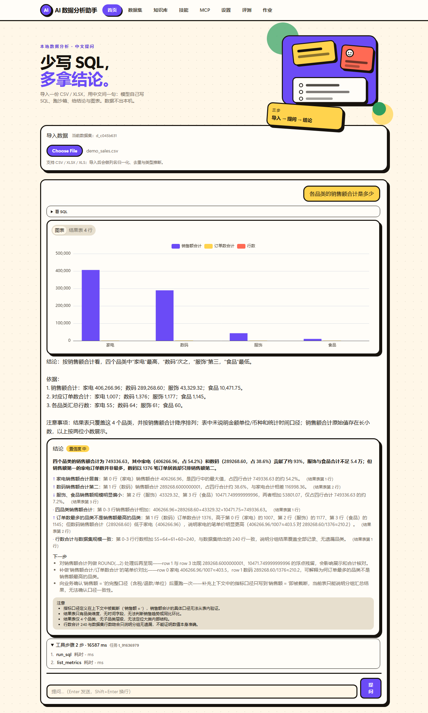
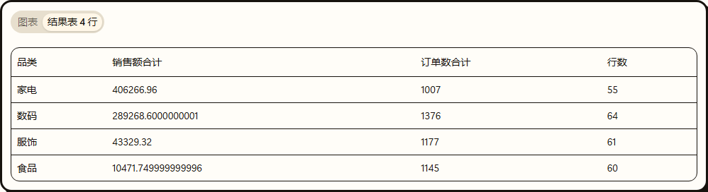
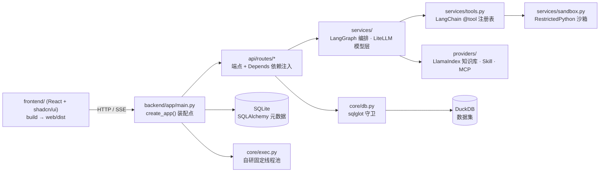

<div align="center">

# 📊 知析 · AI 数据分析助手

**上传一张业务表格，用中文提问 —— 模型自己规划步骤、调用工具查数与算数，给出带数字依据的结论**

[](https://github.com/Lsilence7807/Knowledge-Analysis-Assistant/actions/workflows/ci.yml)


单机部署 · 零外部服务 · 结论里的每个数字都能回溯到结果表的某一行

</div>

---

## 📸 效果预览

| 提问 → 步骤 → 结论 | 结果表（每个数字可回溯到行） |
| :---: | :---: |
|  |  |

上图问答用的就是仓库自带的 `examples/demo_sales.csv`（240 行 × 7 列），可直接上传复现。

## 🎯 它解决什么问题

业务方要一个数，通常要等数据同学写 SQL、发文件、再回来确认口径。这个项目把这条链路压成一句话：**上传表格 → 用中文提问 → 拿结论**。

可不可信不靠模型自觉，靠工程约束：

- 模型只负责「规划 + 选工具」，取数与算数交给 SQL 引擎和统计函数；结论里的数字必须能指认到结果表的某一行某一列（`row` + 列名）；
- SQL 只放行单条只读 SELECT，越权、超时、超行数一律拒绝；
- 证据不足写进「注意事项」，不编造；指代不清先反问。

## ✨ 核心能力

**数据接入与画像**

- CSV / XLSX / XLS（≤50MB）上传 → 自动清洗（列名归一、类型推断、完全重复行去重、缺失率统计、空列提示）→ 落 DuckDB 数据集
- 数据画像：行列数、字段类型、缺失率、枚举样例；清洗日志逐条可查
- 数据集带版本号，重导入或改清洗规则自动 +1

**多步 Agent 分析**

- 中文提问 → 模型自主规划并依次调用工具（默认 ≤6 步）；每步的工具名、耗时、返回行数、参数摘要都在「步骤」面板可查
- 内置工具：SQL 查询、描述统计、IQR + z-score 双规则异常检测、指标口径、知识库检索、Skill、MCP、受限代码执行
- 步数用尽返回已完成的部分，而不是报错

**结论输出**

- 结构化结论卡片：摘要 / 发现 / 异常 / 建议 / 置信度 / 注意事项
- 每条发现标明依据的行与列；表里答不了的部分直接说答不了，不硬凑

**可插拔扩展**（各自独立开关，关闭或故障时降级而非报错）

- **Skill**：`SKILL.md` 目录技能包，prompt 型注入上下文，script 型在受限子进程执行
- **知识库**：md / txt / pdf / docx → 分块 → 向量召回（LlamaIndex + LanceDB；配了 embedding 才走向量，没配自动回落 SQLite FTS5）→ 带出处的片段注入
- **MCP**：按配置接标准 stdio server，白名单调用，返回内容按不可信数据处理

**交互**

- 前端（v3.1 起换 React + shadcn/ui 骨架，顶部导航栏切页）：首页只放 上传 → 提问 → 结论卡片 → 结果表 → 图表；模型（API）配置、知识库、技能、MCP、评测、作业各自成页
- SSE 流式：`plan → sql → row_count → token* → insight → trace → done`，客户端断开即取消上游模型调用
- ECharts 走本地资源离线可用，柱状 / 折线 / 饼图可切换

**模型接入**

- 页面填任意 OpenAI 兼容厂商的 `base_url` + 模型名 + 密钥，写本机 `config/local.json`，免重启生效
- 密钥不进代码、日志与 SQL

## 🔒 安全边界

| 面 | 做法 |
| --- | --- |
| SQL | 只允许单条 SELECT；拒不许多语句、DDL/DML；只读连接；10s 超时；5000 行封顶，超限只回摘要与列名 |
| 代码执行 | RestrictedPython 编译期守卫 + `python -I` 隔离子进程 + import 白名单 + 20s / 1MB 限额 + 只注入当前数据集的只读副本（进程级隔离，非容器级） |
| 提示注入 | 知识库、MCP、上传内容一律按不可信数据包裹，并剥离指令性内容 |
| 密钥 | 只从本机 `config/local.json` 或环境变量读取，不进仓库、日志与 SQL |

## 🏗️ 架构

（v3.1 骨架整改后的形态；F1/F2/F10 已于 2026-09-21/22 落地，图与代码一致）



## 🚀 怎么跑

什么都不想敲：**双击 `启动.cmd`**。首次会自动建 `.venv`、按 `requirements.lock` 装依赖、起服务并打开 `http://127.0.0.1:8017/`；之后每次双击直接起来（服务已在跑就只开页面）。需要机器上有 Python 3.11+。

**想让本机也像公网那样要登录**：双击 `启动-需登录.cmd`（同上，额外打开单密码认证）。口令串在 `config/auth.local.json`，改 `APP_PASSWORD_HASH` 一行即可；文件被 gitignore 挡住，不进仓库。

**可插拔能力默认是关的**（设计口径：新增能力默认关，免得没配依赖就报错）。双击 `启动.cmd` 起来的是核心链路——上传、SQL、统计、结论、图表、会话记忆、问答复用都能用；下面这几项要自己开：

```powershell
# 起服务之前设进环境（只作用于当前这个进程树）：
$env:ENABLE_SKILLS = 'true'    # skills/ 目录技能包（P6）
$env:ENABLE_KB = 'true'        # 知识库检索（P7；向量召回还要在页面配 embedding）
$env:ENABLE_SANDBOX = 'true'   # 受限代码执行（P15）
$env:ENABLE_MCP = 'true'       # 标准 MCP server（P8；还要 config/mcp.json 里的 server 起得来）
$env:ENABLE_STREAM = 'true'    # /ask/stream 流式（P17；关着时这个端点回 503）
$env:ENABLE_JOBS = 'true'      # 后台作业与报告导出（P18 / P19）
```
别把它们写成**用户级环境变量**：那会被之后每个终端与测试继承，`ENABLE_AUTH` 之类一漏进 `pytest` 就把测试搞红（本机踩过这条）。

想手动来，就按下面四条命令：

```
& .\.venv\Scripts\python.exe -m pip install -r requirements.txt
# 复现当前环境锁版本：pip install -r requirements.lock（requirements.txt 留给想装最新版本的人）
cd frontend; npm ci; npm run build; cd ..
# 前端只构建一次；改完前端重跑这两条（v3.1 起前端是 React，产物落 web/dist）
& .\.venv\Scripts\python.exe -m uvicorn app.main:app --app-dir backend --port 8017
# 起服务前先确认端口没被旧进程占着：Get-NetTCPConnection -LocalPort 8017 -State Listen
# 页面：http://127.0.0.1:8017/ ；接口文档：/docs
# 模型：在页面上填任意 OpenAI 兼容厂商的 base_url + 模型名 + 密钥（写本机 config/local.json，不进仓库）
```

质量门与验收（已完成阶段：MVP 七段 + P6 技能 + P7 知识库 + P8 MCP + P13 Agent + P15 沙箱与指标 + P17 流式 + P21 性能契约，快照 250 passed / 7 skipped；与 `.github/workflows/ci.yml` 同口径。测试必须在真实文件系统与正常权限下跑，受限沙箱里 `tmp_path` 不可写）：

```
python -m ruff check backend/app tests
python -m ruff format --check backend/app tests
python -m pytest tests -q
cd frontend; npm run lint; npx tsc --noEmit; npm run build
```

## 📁 项目结构

```
（v3.1 结构；F1/F2/F10 已落地，与代码一致）
backend/app/    后端：api/routes 端点 · api/deps 依赖注入 · core 配置与守卫 · models ORM · schemas 边界模型 · services 业务（LangGraph 编排 / LiteLLM 模型层 / 检索 / 沙箱 / 报告）
  providers/      知识库 / Skill / MCP / 数据源四个可插拔能力
frontend/       前端源码（React + Vite + TS + shadcn/ui），构建产物落 web/dist
web/dist/       前端构建产物（gitignore，服务从这里挂静态文件）
config/         工具、指标口径、模型、MCP 配置（local.json 存本机密钥，不进仓库）
skills/         示例技能包
tests/          每个阶段一个测试文件（共 257 例 = 250 自动 + 7 浏览器验收，浏览器默认跳过，见 `docs/问题总表.md` §3.3）
bench/          性能基线脚本与基线 JSON
examples/       演示数据
deploy/         多阶段镜像与 Caddy 反代 · docker-compose.yml 编排
docs/           设计文档、台账、索引
```

## 🛠️ 技术栈

下表逐条对齐代码，依据是 `requirements.txt` 与 `frontend/package.json`；目标形态与选型理由见 `docs/功能介绍与技术栈.md`。

| 层 | 选型 |
| --- | --- |
| 后端骨架 | FastAPI 官方模板结构：`api/routes` + `api/deps.py` + `core` + `models` + `schemas` + `services` + `alembic` |
| 语言 / Web | Python 3.11+ · FastAPI + uvicorn · pydantic v2 + pydantic-settings |
| 前端骨架 | React 19 + Vite + TypeScript + Tailwind v4 + shadcn/ui · TanStack Query / Router · ECharts · assistant-ui（聊天壳，底层 AI SDK 传输层）· API 类型由 `openapi-typescript` 从 `/openapi.json` 生成 |
| 数据 | DuckDB（分析）· SQLite + SQLAlchemy 2.0 + Alembic（元数据）· pandas / numpy（清洗、统计、数据画像自研） |
| 模型 | LiteLLM（多厂商路由 / 回退 / 重试 / 结构化输出 / embedding / 成本） |
| Agent 与记忆 | LangGraph `StateGraph` + `SqliteSaver` checkpointer |
| 检索 | LlamaIndex + LanceDB（FTS5 关键词保留为降级） |
| 工具 | LangChain `@tool` + pydantic 入参；MCP 走官方 SDK（`langchain-mcp-adapters` 要求 mcp<2.0，与仓库的 mcp 2.2 冲突，未装） |
| 流式 | SSE（sse-starlette） |
| 守卫 | sqlglot 解析树判 SQL · RestrictedPython 编译期守卫管沙箱 |
| 并发 | `core/exec.py` 自研固定线程池 25 行（`anyio` 在沙箱子进程路径实测挂住、`run_in_threadpool` 是 async 口子而调用点全是同步函数，都没有可用对应物） |
| 认证 | itsdangerous 签名 cookie + slowapi 限流（单密码，pbkdf2 校验） |
| 观测 | Langfuse（没配密钥时只用本地 `trace_spans` 表） |
| 评测 | deepeval（faithfulness 与本地确定性口径交叉校验；Ragas 0.4.3 与本机 langchain 版本冲突，未装） |
| 作业 / 调度 | huey（SQLite 队列）· APScheduler（定时维护） |
| 文档与报告 | MarkItDown / pypdf / python-docx（Docling 属重型档，只进 `FRAMEWORK_PROFILE=full` 的镜像）· docxtpl / python-pptx / Jinja2 |
| 部署 | 多阶段 Dockerfile（node 构建前端 → python 运行时）· docker-compose · Caddy |
| 质量 | pytest · ruff · eslint / tsc / vite build · GitHub Actions |

## 📈 性能契约

性能不是「感觉快」，而是验收条件：`bench/bench.py` 产出基线 JSON 进 git，退化即 CI 失败。

| 项 | 当前基线 |
| --- | --- |
| 50 万行聚合（GROUP BY） | p50 0.0565s / p95 0.0619s |
| 验收预算 | 1.5s |
| 统计口径 | 20 轮取分位，执行器默认 4 线程，单机 |

## 📚 文档

- `docs/索引.md` —— 文档入口与阅读顺序
- `docs/功能介绍与技术栈.md` —— 目标形态与选型理由
- `docs/系统总体设计.md` —— 契约与阶段计划（§5 为各段施工单）
- `docs/最小可用集.md` —— 第一版范围、怎么跑、扩展契约
- `docs/代码台账.md` —— 已完成文件、已知问题、待推送记录
- `docs/交接-*.md` —— 会话交接

## 🗺️ 路线图

**已实现**：MVP 七段（P0–P5）+ P6 技能 + P7 知识库 + P8 MCP + P13 Agent + P15 沙箱与指标 + P17 流式 + P21 性能并发契约。

**骨架整改（F1 / F2 / F10，已完成）**：后端按 FastAPI 官方模板的目录与依赖注入重排（`api/routes` + `api/deps.py` + `core` + `models` + `schemas` + `services` + Alembic），前端换成 React + Vite + shadcn/ui 骨架（聊天壳用 assistant-ui，流式与工具调用用现成组件，API 客户端由 `/openapi.json` 生成），部署补上多阶段镜像与 compose；`/openapi.json` 与接口、断言一个没动。逐段范围见 `docs/系统总体设计.md` §5 的 F1 / F2 / F10。

**框架化改造（F1~F10 十段全部完成，2026-09-22）**：自研实现已换成现成框架，接口与验收命令不变——`LiteLLM`（模型层）→ `LangGraph`（Agent 与记忆）→ `LlamaIndex + LanceDB`（检索与向量）→ `SQLAlchemy + Alembic + pydantic-settings`（数据层）→ `sqlglot + RestrictedPython + itsdangerous`（守卫与认证）→ `Langfuse + deepeval`（观测与评测）→ `huey + Docling`（作业与文档）。逐段范围与验收见 `docs/系统总体设计.md` §5「框架化改造（F 段）」，模块映射见同文 §11；逐条问题、上限与坑见 `docs/问题总表.md`。

**前端视觉与一键启动（P5.1 / P5.2 / P5.3，已完成）**：P5.1 把配色、3px 描边、硬阴影收进 `:root` 旋钮 → P5.2 双击 `启动.cmd` 一键起 → P5.3 视觉风格 v2：装饰层 `frontend/src/components/decor.tsx`（Eyebrow / Sticker / TiltNote / Blob / Illustration）+ 三张自写 SVG 插画 `frontend/public/illustrations/`（离线可用、改色只改旋钮）+ 卡片 / 按钮 / 输入类的描边与硬阴影收进组件默认类，页面不再手抄常量，后端与接口契约零改动。验收 `tests/test_p5_style.py`。

**未开工**（设计已定，按 `docs/系统总体设计.md` §5 施工）：

- P20 日常使用功能（收藏问题 · 数据集重导入与 schema drift 报告）
- P22 多表关系推断与 join 校验 · P23 企业数据源只读同步 · P24 反馈与配额

P9 多模型 / P10 记忆 / P11 部署与登录 / P14 语义检索 / P16 评测 / P18 作业 / P19 报告导出已随 F 段落地（F3 / F4 / F7 / F5 / F8 / F9），逐段验收见 `docs/系统测试清单.md`。

**明确不做**：模型微调 / 自训练、K8s 与多租户 RBAC、自研向量检索引擎与 embedding、自研 agent 循环 / 评测 / 观测框架（这三类直接用 LangGraph / deepeval / Langfuse）、扫描件 OCR、移动端适配。

## 🤝 参与贡献 · 📄 许可

开发约定、环境与提交前必跑的检查见 `CONTRIBUTING.md`；许可证为 MIT，见 `LICENSE`。
