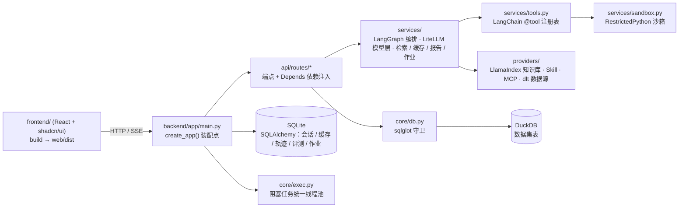

<div align="center">

# 📊 知析 · AI 数据分析助手

**上传一张业务表格，用中文提问 —— 模型自己规划步骤、调用工具查数与算数，给出带数字依据的结论**

[](https://github.com/Lsilence7807/Knowledge-Analysis-Assistant/actions/workflows/ci.yml)


单机部署 · 零外部服务 · 结论里的每个数字都能回溯到结果表的某一行

</div>

---

## 📸 效果预览

| 提问 → 步骤 → 结论 | 结果表（每个数字可回溯到行） |
| :---: | :---: |
|  |  |

上图问答用的就是仓库自带的 `examples/demo_sales.csv`（240 行 × 7 列），可直接上传复现。

## 🎯 它解决什么问题

业务方要一个数，通常要等数据同学写 SQL、发文件、再回来确认口径。这个项目把这条链路压成一句话：**上传表格 → 用中文提问 → 拿结论**。

可不可信不靠模型自觉，靠工程约束：

- 模型只负责「规划 + 选工具」，取数与算数交给 SQL 引擎和统计函数；结论里的数字必须能指认到结果表的某一行某一列（`row` + 列名）；
- SQL 只放行单条只读 SELECT，越权、超时、超行数一律拒绝；**跨表 join 必须命中已确认的关系**，不让模型猜连接条件；
- 证据不足写进「注意事项」，不编造；指代不清先反问；
- 每个数字、每次工具调用、每一分钱都留痕：`agent_steps` + `trace_spans`（Langfuse）+ 评测基线。

## ✨ 核心能力

**数据接入 · 清洗 · 画像**

- CSV / XLSX / XLS 上传（≤50MB，多 sheet 取首个并记进清洗日志）；PDF / Word 走知识库通道（扫描件 OCR 不做）
- **企业库只读同步**：配数据源 → 测连通 → 全量或按水位列增量同步（dlt + SQLAlchemy）→ 落成与上传**完全同构**的数据集（同样有版本号、画像、drift 报告）；连接串只从环境变量取，永不落库落盘
- 自动清洗：列名归一、类型推断、规则校验（pandera）、完全重复行去重、缺失率统计、空列提示
- 数据画像：行列数、字段类型、缺失率、枚举样例；清洗日志逐条可查
- 数据集带版本号（重导入或改清洗规则 +1，问答缓存同步失效）与 **schema drift 报告**（字段增删、类型变更）；同结构双表对比、结果导出 CSV / Excel
- 删除数据集连带清掉 DuckDB 表、原始文件、元数据与任务流水

**多步 Agent 分析**

- 中文提问 → LangGraph 图自主规划并依次调用工具（默认 ≤6 步）；每步的工具名、耗时、返回行数、参数摘要都在「步骤」面板可查
- 内置工具 11 个：SQL 查询、描述统计、IQR + z-score 双规则异常检测、指标口径、知识库检索、技能列表 / 取用、MCP 调用、受限代码执行、多表关系、报告导出
- **多表分析**：自动推断关联列（列名同义 + 类型一致 + 值交集采样）→ 给候选与置信度 → 人工确认后才允许 join；未登记的跨表 join 一律拒绝并回传候选
- 步数用尽返回已完成的部分，而不是报错

**结论输出**

- 结构化结论卡片：摘要 / 发现 / 异常 / 建议 / 置信度 / 注意事项
- 每条发现标明依据的行与列；表里答不了的部分直接说答不了，不硬凑

**多轮对话 · 记忆 · 复用**

- 会话内追问支持指代式提问（带最近 6 轮提问与 SQL、最近 2 轮结论摘要）；会话状态落 LangGraph checkpointer
- 精确缓存（毫秒级、零模型调用）+ 语义缓存（复用历史 SQL、结论按当前数据重算），按「数据集 + 数据版本 + 模型 + 提示词版本」四元组隔离，命中率分精确与语义两栏可查
- **收藏问题一键重跑**、任务历史检索；耗时分析自动转后台作业并给进度
- 报告导出：Markdown / Word / PPT（docxtpl、python-pptx、Jinja2 模板）

**可插拔扩展**（各自独立开关，关闭或故障时降级而非报错）

- **Skill**：`SKILL.md` 目录技能包，prompt 型按需注入上下文，script 型在受限子进程执行；`list_skills` → `use_skill` 渐进披露
- **知识库**：md / txt / pdf / docx → 分块（≤500 字符）→ 向量召回（LlamaIndex + LanceDB，20 取 5）+ 关键词通路（SQLite FTS5）+ 重排，答案带出处；embedding 不可用时自动回退关键词
- **MCP**：按配置接标准 stdio server，自动发现工具、白名单调用，返回内容按不可信数据处理
- **模型接入**：页面填任意 OpenAI 兼容厂商的 `base_url` + 模型名 + 密钥（写本机 `config/local.json`，免重启）；按用途分配模型（便宜的出 SQL、强的写结论）；失败按回退链换备选，全挂给结构化说明

**评测 · 观测 · 运营**

- 评测：JSONL golden set + 基线 JSON 进 git，量化忠实度 / SQL 通过率 / 降级率 / 成本；人工 + LLM as Judge，Rubrics 三维（数字可追溯 / 不超证据 / 口径合规）
- 观测：Langfuse 收模型与工具调用的耗时、token、成本（无密钥时只用本地 `trace_spans` 表），`/trace/stats` 回答「花了多少钱、慢在哪」
- 反馈闭环：结论卡片赞 / 踩入库，一条 bad 反馈可一键提升为评测样例
- 成本闸门：按日累计 token 与成本配额，超限拒绝重分析并返回 429；缓存命中不计入配额

**交互**

- 前端：首页只放 上传 → 提问 → 结论卡片 → 结果表 → 图表；模型配置、知识库、技能、MCP、评测、作业、数据源、收藏各自成页，顶部导航切页
- SSE 流式：`plan → sql → row_count → token* → insight → trace → done`，客户端断开即取消上游模型调用
- ECharts 走本地资源离线可用，柱状 / 折线 / 饼图可切换

**部署**

- 多阶段镜像（node 构建前端 → python 运行时）+ docker-compose + Caddy 反代自动 HTTPS；单密码登录 + 登录限流 + 请求限频
- 依赖分档：`FRAMEWORK_PROFILE=core`（默认，轻量解析）/`full`（带 Docling 重型 PDF 版面解析）

## 🔒 安全边界

| 面 | 做法 |
| --- | --- |
| SQL | 只允许单条 SELECT（sqlglot 解析树判定）；拒不许多语句、DDL/DML；只读连接；10s 超时；5000 行封顶，超限只回摘要与列名；跨表 join 必须命中已确认关系 |
| 代码执行 | RestrictedPython 编译期守卫 + `python -I` 隔离子进程 + import 白名单 + 20s / 1MB 限额 + 只注入当前数据集的只读副本（进程级隔离，非容器级） |
| 外部数据源 | 只读拉取，永不执行 DDL/DML；连接串只通过环境变量引用，禁止写进配置、数据库与日志 |
| 提示注入 | 知识库、MCP、上传内容一律按不可信数据包裹，并剥离指令性内容（统一入口 `core/guardrail.py`） |
| 认证 | itsdangerous 签名 cookie（HttpOnly、SameSite=Lax，公网强制 Secure）+ slowapi 限流；开认证时框架自带的 `/openapi.json`、`/docs`、`/redoc` 一并关闭 |
| 密钥与成本 | 密钥只从本机 `config/local.json` 或环境变量读取，不进仓库、日志与 SQL；按日配额挡在模型出口 |
| 脱敏 | 反馈只存问题、SQL、结论摘要，不存原始数据行 |

## 🏗️ 架构

（v3.1 骨架 + v3.0 框架化之后的形态；分层依赖单向，下层禁止 import 上层）



模型调用只有一个出口（LiteLLM）：业务代码不认识厂商，换厂商只改一份配置。

## 🚀 怎么跑

什么都不想敲：**双击 `启动.cmd`**。首次会自动建 `.venv`、按 `requirements.lock` 装依赖、缺 `web/dist` 时构建前端、起服务并打开 `http://127.0.0.1:8017/`；之后每次双击直接起来（服务已在跑就只开页面）。需要机器上有 Python 3.11+。

**想让本机也像公网那样要登录**：双击 `启动-需登录.cmd`（同上，额外打开单密码认证）。口令串在 `config/auth.local.json`，改 `APP_PASSWORD_HASH` 一行即可；文件被 gitignore 挡住，不进仓库。

**可插拔能力默认是关的**（设计口径：新增能力默认关，免得没配依赖就报错）。默认起来的是核心链路——上传、SQL、统计、结论、图表、会话记忆、问答复用、收藏都能用；下面这几项要自己开（起服务之前设进环境，只作用于当前进程树）：

```powershell
$env:ENABLE_SKILLS = 'true'    # skills/ 目录技能包
$env:ENABLE_KB = 'true'        # 知识库检索（向量召回还要在页面配 embedding）
$env:ENABLE_SANDBOX = 'true'   # 受限代码执行
$env:ENABLE_MCP = 'true'       # 标准 MCP server（还要 config/mcp.json 里的 server 起得来）
$env:ENABLE_STREAM = 'true'    # /ask/stream 流式（关着时该端点回 503）
$env:ENABLE_JOBS = 'true'      # 后台作业与报告导出
$env:ENABLE_SOURCES = 'true'   # 外部数据源只读同步（还要 config/sources.json）
```

**别把它们写成用户级环境变量**：那会被之后每个终端与测试继承，`ENABLE_AUTH` 之类一漏进 `pytest` 就把测试搞红。

想手动来，就按下面四条命令：

```
& .\.venv\Scripts\python.exe -m pip install -r requirements.txt
# 复现当前环境锁版本：pip install -r requirements.lock（requirements.txt 留给想装最新版本的人）
cd frontend; npm ci; npm run build; cd ..
# 前端只构建一次；改完前端重跑这两条（前端是 React，产物落 web/dist）
& .\.venv\Scripts\python.exe -m uvicorn app.main:app --app-dir backend --port 8017
# 起服务前先确认端口没被旧进程占着：Get-NetTCPConnection -LocalPort 8017 -State Listen
# 页面：http://127.0.0.1:8017/ ；模型：在页面上填任意 OpenAI 兼容厂商的 base_url + 模型名 + 密钥
```

质量门与验收（与 `.github/workflows/ci.yml` 同口径。测试必须在真实文件系统与正常权限下跑，受限沙箱里 `tmp_path` 不可写）：

```
python -m ruff check backend/app tests
python -m ruff format --check backend/app tests
python -m pytest tests -q
cd frontend; npm run lint; npx tsc --noEmit; npm run build
$env:KAA_E2E="1"; python -m pytest tests/test_ui_browser.py -q   # 真浏览器验收（默认整模块跳过）
```

## 📁 项目结构

```
（v3.1 结构）
backend/app/    后端：api/routes 端点 · api/deps 依赖注入 · core 配置与守卫 · models ORM · schemas 边界模型 · services 业务（LangGraph 编排 / LiteLLM 模型层 / 检索 / 缓存 / 沙箱 / 报告 / 作业）
  providers/      知识库 / Skill / MCP / 数据源四个可插拔能力
frontend/       前端源码（React + Vite + TS + shadcn/ui），构建产物落 web/dist
web/dist/       前端构建产物（gitignore，服务从这里挂静态文件）
config/         工具、指标口径、模型、MCP、数据源配置（local.json 存本机密钥，不进仓库）
skills/         示例技能包
evals/          golden set 与评测基线 JSON
tests/          每个阶段一个测试文件（另有真浏览器验收套件，默认跳过）
bench/          性能基线脚本与基线 JSON
examples/       演示数据
deploy/         多阶段镜像与 Caddy 反代 · docker-compose.yml 编排
docs/           设计文档、台账、索引
```

## 🛠️ 技术栈

| 层 | 选型 |
| --- | --- |
| 后端骨架 | FastAPI 官方模板结构：`api/routes` + `api/deps.py` + `core` + `models` + `schemas` + `services` + `alembic` |
| 语言 / Web | Python 3.11+ · FastAPI + uvicorn · pydantic v2 + pydantic-settings |
| 前端骨架 | React 19 + Vite + TypeScript + Tailwind + shadcn/ui · TanStack Query / Router / Table · ECharts · assistant-ui（聊天壳，底层 AI SDK 传输层）· API 类型由 `openapi-typescript` 从 `/openapi.json` 生成 |
| 数据 | DuckDB（分析）· SQLite + SQLAlchemy 2.0 + Alembic（元数据）· pandas / numpy · pandera（清洗规则校验）· ydata-profiling（数据画像） |
| 模型 | LiteLLM（多厂商路由 / 回退 / 重试 / 结构化输出 / embedding / 成本 / 缓存 / 配额） |
| Agent 与记忆 | LangGraph `StateGraph` + SqliteSaver checkpointer |
| 检索与向量 | LlamaIndex + LanceDB（分块 / 索引 / 召回 / rerank；FTS5 关键词通路并存互为降级） |
| 工具 | LangChain `@tool` + pydantic 入参（JSON Schema 由框架生成） |
| 流式 | SSE（sse-starlette，前端接 AI SDK 传输层） |
| 守卫与认证 | sqlglot（SQL 解析树）· RestrictedPython（沙箱编译期守卫）· itsdangerous（签名 cookie）· slowapi（限流） |
| 并发 | `core/exec.py` 阻塞任务统一线程池（`EXEC_MAX_WORKERS=4`），DuckDB 与 pandas 不阻塞事件循环 |
| 数据源接入 | dlt（只读抽数与增量水位）+ SQLAlchemy 引擎 + APScheduler（定时同步） |
| 文档与报告 | MarkItDown / Docling（重档，仅 `FRAMEWORK_PROFILE=full`）/ pypdf / python-docx · docxtpl / python-pptx / Jinja2 |
| 观测与评测 | Langfuse（耗时 / token / 成本）· deepeval（数据集、指标与基线对比） |
| 作业与调度 | huey（SQLite 队列）· APScheduler（定时维护与同步） |
| 部署 | 多阶段 Dockerfile（node 构建前端 → python 运行时）· docker-compose · Caddy 自动 HTTPS |
| 质量 | pytest + pytest-asyncio · Playwright（真浏览器验收）· ruff · eslint / tsc / vite build · GitHub Actions（`requirements.lock` 锁版本） |

## 📈 性能契约

性能不是「感觉快」，而是验收条件：`bench/bench.py` 产出基线 JSON 进 git，退化即 CI 失败。

| 项 | 目标 |
| --- | --- |
| 单表 50 万行聚合（GROUP BY） | p95 ≤ 1.5s（当前基线 p50 0.0565s / p95 0.0619s） |
| 缓存命中 | p95 ≤ 100ms |
| `/ask/stream` 首帧 | ≤ 1.2s |
| 10 并发 | 无 5xx，事件循环心跳延迟 p95 ≤ 200ms |
| 统计口径 | 单机 4 核，执行器默认 4 线程，bench 取 20 轮分位 |

## 🚫 明确不做

这些方向是**范围外**，写了算跑偏（设计文档 §1 非目标）：模型微调 / LoRA / 蒸馏 / 自训练；K8s、多租户 RBAC、合规审计；自建推理集群、向量引擎与 embedding；自研 AI 网关、计费与训练平台；移动端适配；扫描件 OCR；对企业库的写操作与 DDL；自研 ETL 调度平台；桌面端安装包。

## 📚 文档

- `docs/索引.md` —— 文档入口与阅读顺序
- `docs/系统总体设计.md` —— 唯一施工依据：§4 冻结契约、§5 阶段计划、§8 ADR、§9 依赖、§10 环境变量与质量门、§11 框架选型总表
- `docs/系统测试清单.md` —— 怎么算测全了：逐段成功 / 反例 / 手工项、专项、非目标阈值、完成定义
- `docs/功能介绍与技术栈.md` —— 功能清单、技术栈与容量预期
- `docs/代码台账.md` —— 已完成文件、已知问题、逐轮记录
- `docs/问题总表.md` —— 全部问题一次看全（已办结 / 刻意保留的上限 / 还开着的怎么关）
- `docs/留白-未测项.md` —— 还没测到的（要装什么、补哪儿）
- `docs/交接-*.md` —— 会话级交接

## 🤝 参与贡献 · 📄 许可

开发约定、环境与提交前必跑的检查见 `CONTRIBUTING.md`；许可证为 MIT，见 `LICENSE`。
